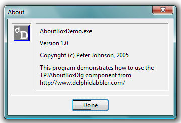

# [About Box Component](../AboutBox.md) Overview

> This page provides an overview of the features of the About Box Component. If you are looking for information on programming with the component please see the [Programmers' Guide](./API.md).

This project provides a single non-visual component that encapsulates an "About" dialogue box.

When displayed the about box appears like this (screen shot taken on Windows Vista):

The text displayed in the about box can be set using properties exposed by the component, or can be extracted from version information using a linked DelphiDabbler Version Information Component.

The dialogue's position can be specified relative to the screen, desktop or parent application. There is a single close button whose appearance and position is customised. The About box also displays the program's icon. Finally, the dialogue box's font can be altered.

The code is Unicode compatibale when compiled on Unicode enabled versions of Delphi.

## Required component

_TPJAboutBoxDlg_ requires that a DelphiDabbler [Version Information Component](../VerInfo/Overview.md) is installed in order to compile.

## Demo program

A demo program is included in the component download that can be used to exercise the component.

## Links

* [Programmers' Guide](./API.md) -- Classes, methods, properties etc.
