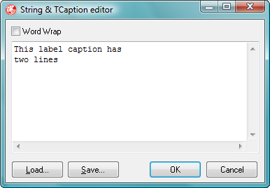

# [Extended String Property Editor](../StringPE.md) Version 1 User Guide

> This is the user guide for version 1 of the Extended String Property Editor. If you are using version 2 there is a [different guide](./UserGuideV2.md).

This property editor enhances the existing Delphi string property editor. It works will all **string** and `TCaption` properties.

At first sight the Object Inspector's string property editor is unchanged, and in fact it can be used as before. On closer examination you will find an ellipsis button to the right hand side of the property editor's data entry area. Clicking this button displays a resizeable dialog box in which the property's value can be entered or modified, like this:

When typing in the edit box, pressing _Return_ starts a new line.

The dialog box's controls are:

* _Word Wrap_ check box: This check box toggles word wrap on and off. When word wrap is off you will need to scroll to the right to see long lines.
* _Load_ button (_Alt+L_): Allows text from a file to be loaded into the editor. This overwrites any existing content. A standard Open File dialog box is used to select the file.
* _Save_ button (_Alt+S_): Saves the text entered in the editor to file. A standard Save File dialog box is used to specify the file name.
* _OK_ button (_Ctrl+Return_): Closes the dialog box and updates the property.
* _Cancel_ button (_Esc_): Closes the dialog box without updating the property.

In addition the editor supports the usual cut (_Ctrl+X_), copy (_Ctrl+C_), paste (_Ctrl+V_) and undo (_Ctrl+Z_) text operations from a context menu.

If any new lines are included in the text entered in the editor they may or may not be displayed in the object inspector, depending on the version of Delphi. If they are displayed it may be as pairs of vertical bars or pairs of empty squares

Both word-wrapping and dialog box size and position are persistent.
