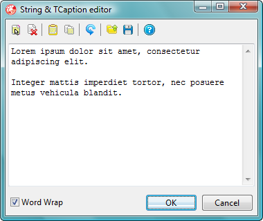

# [Extended String Property Editor](../StringPE.md) Version 2 User Guide

> This is the user guide for version 2 of the Extended String Property Editor. If you are still using version 1 there is a [different guide](./UserGuideV1.md).

This property editor enhances the existing Delphi string property editor. It works will all **string** and `TCaption` properties.

At first sight the Object Inspector's string property editor is unchanged, and in fact it can be used as before. On closer examination you will find an ellipsis button to the right hand side of the property editor's data entry area. Clicking this button displays a resizeable dialogue box in which the property's value can be entered or modified, like this:

When typing in the edit box, pressing _Return_ starts a new line.

The dialogue box has a tool-bar above the edit box and other controls below. The tool buttons are, from left to right:

*  _Select all text_ (_Ctrl+A_): Selects all the text in the edit box. If there is no text then this button is disabled. This command is also available from the edit box's context menu.
*  _Clear all text_ (_Ctrl+Del_): Deletes all text in the edit box.
*  _Paste over text_ (_Shift+Ctrl+V_): Replaces any existing text in the edit box with text pasted from the clipboard. This button is disabled if there is no text on the clipboard.
*  _Copy all text_ (_Shift+Ctrl+C_): Copies all the text from the edit box to the clipboard. This button is disabled if there is no text to copy.
*  _Undo_ (_Ctrl+Z_): Undoes the previous edit. If the last edit can't be undone this button is disabled. This command is also available on the context menu.
*  _Load from file_ (_Ctrl+L_): Loads the contents of selected text file into the edit box, replacing any existing text.
*  _Save to file_ (_Ctrl+S_): Saves the text from the edit box to a selected file.
*  _Online help_ (_F1_): ***[Broken]*** Attempts to display an old, defunct, wiki page in the default browser.

In addition to the above commands, the edit box supports the usual cut (_Ctrl+X_), copy (_Ctrl+C_) and paste (_Ctrl+V_) text operations from its context menu.

The controls below the edit box are:

* _Word Wrap_ check box: This check box toggles word wrap on and off. When word wrap is off you will need to scroll to the right to see long lines.
* _OK_ button (_Ctrl+Return_): Closes the dialogue box and updates the property.
* _Cancel_ button (_Esc_): Closes the dialogue box without updating the property.

If any new lines are included in the text entered in the editor they may or may not be displayed in the object inspector, depending on the version of Delphi. If they are displayed it may be as pairs of vertical bars or pairs of empty squares

Both word-wrapping and dialogue box size and position are persistent.
